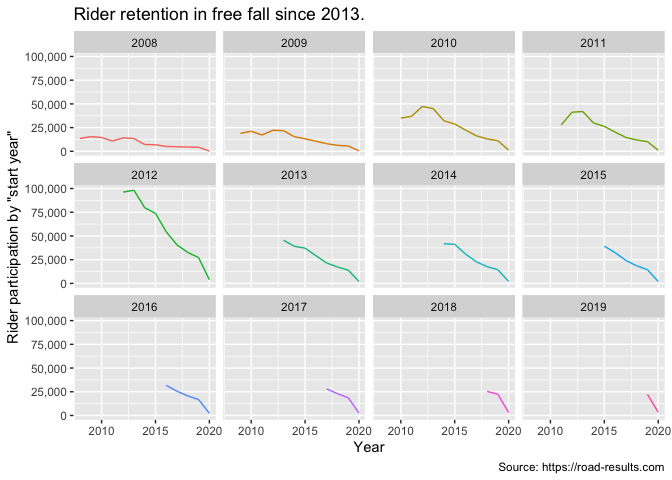

<!-- README.md is generated from README.Rmd. Please edit that file -->

# cyclingResults

<!-- badges: start -->

<!-- badges: end -->

The goal of cyclingResults is to query some cycling results.

## Installation

## Example

Compare rider participation by region over time.

``` r
library(dplyr)
library(ggplot2)

road_results <- cyclingResults::get_races() 

road_results %>% 
  group_by(date, region, .drop = FALSE) %>% 
  mutate(date = lubridate::floor_date(date, 'year')) %>% 
  summarise(total = sum(racers)) %>% 
  filter(date > '2012-01-01') %>% 
  ggplot(aes(date, total, color = region)) + 
  geom_line() + 
  scale_y_continuous(labels = scales::comma_format()) +
  labs(title = 'Rider participation by region by year.', 
       subtitle = 'January 2012 thru September 2020', 
       caption = 'Source: https://road-results.com',
       x = 'Year', y = 'Total rider participation') + 
  facet_wrap(~region, ) + 
  theme(legend.position = 'none')
```


Explore rider retention over time. Load all race results from 2006 to
2020. `raw_results()` loads a .Rds file of all rider results scraped
from [road results](road-resuls.com).

``` r
library(cyclingResults)
library(tidyverse)

races_raw <- raw_results() %>% 
  mutate(license = readr::parse_number(license)) %>% 
  filter(!is.na(license), 
         nchar(license) > 4 & nchar(license) < 7,
         !license %in% c(91005, 999999))

races_raw %>%
  select(license, date) %>% 
  group_by(license, date = lubridate::floor_date(date, 'year')) %>% 
  count(date, license, sort = TRUE) %>% 
  ungroup() %>% 
  group_by(license) %>%
  # cohort is defined as the earliest date a license appears in the data
  mutate(cohort = min(date)) %>% 
  ungroup() %>% 
  group_by(cohort, date) %>% 
  # total participation by cohort, by year
  summarise(total = sum(n), 
            cohort = as.factor(lubridate::year(cohort))) %>% 
  filter(cohort != 2020) %>% 
  ggplot(aes(date, total, color = cohort)) + 
  geom_line() + 
  scale_y_continuous(labels = scales::comma_format()) + 
  labs(title = 'Rider participation falls over time.', 
       x = 'Year', y = 'Rider participation by "start year"',
       caption = 'Source: https://road-results.com') + 
  facet_wrap(~cohort) + 
  theme(legend.position = 'none')
```


